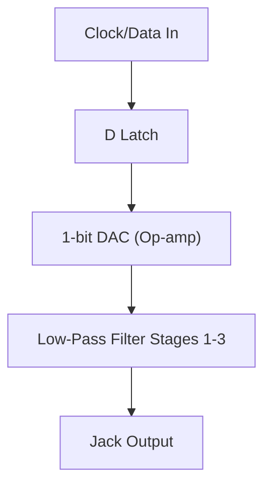

Delta-Sigma DAC
===============

This repo contains the OrCAD 17.4 schematic and board layout files for a prototype digital-to-analog converter project I created for a *Computer Design of Electronic Circuits* elective course I took at the [Faculty of Physics at Sofia University](https://www.phys.uni-sofia.bg/).

--------------------

Photo of the first production prototype, manufactured by [JLCPCB](https://jlcpcb.com/).

Design Goal
===========

The goal of the project was to construct a rudimentary DAC from discrete digital and analog components that could reasonably function at clocks rates of at least 500 kHz.

The board is powered by a 3.3V DC input and is expected to output a standard -500mV to +500mV line-level signal. The expected input is a 3.3V [pulse-density modulated](https://en.wikipedia.org/wiki/Pulse-density_modulation) digital signal. The signal is latched and demodulated using a 1-bit DAC and a 3-stage, 6th order Butterworth Sallen-Key low-pass filter, the output of which is sent to the 3.5 mm jack output.

Documentation
=============

Signal Path
-----------
The following is a simplified diagram of the signal path:

Schematic
---------

The full PDF schematic of the cicuit can be found [here](/doc/schematic.pdf).

Bill of Materials
-----------------

An Excel BOM sheet with corresponding links to the Bulgarian parts distrubutor [Comet Electronics](hhttps://www.comet.bg/) can be found [here](/doc/bill_of_materials.xlsx)

Other
-----

A PDF writeup for the coursework in Bulgarian can be found [here](/doc/documentation_bg.pdf).

The PDF slides for the final presentation that was given in front of the class in Bulgarian can be found [here](/doc/presentation_bg.pdf). 
